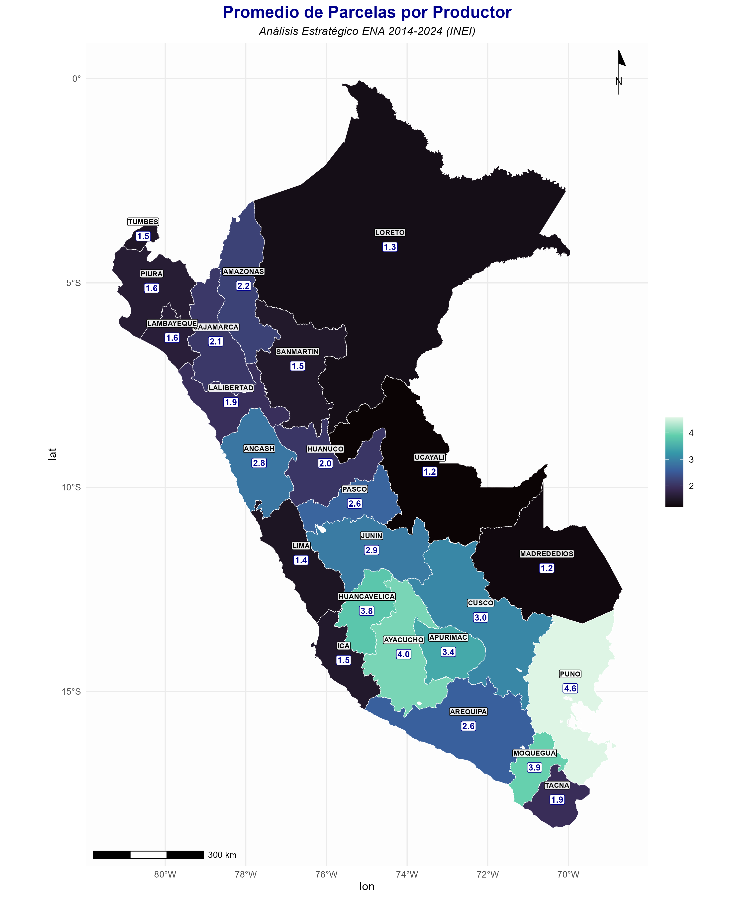
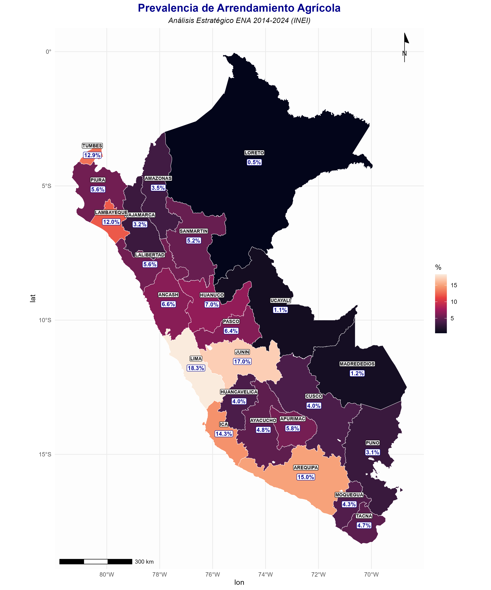
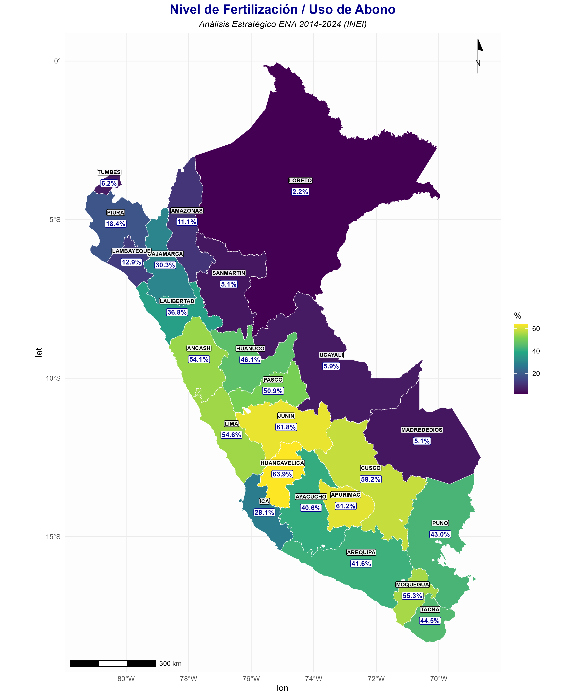
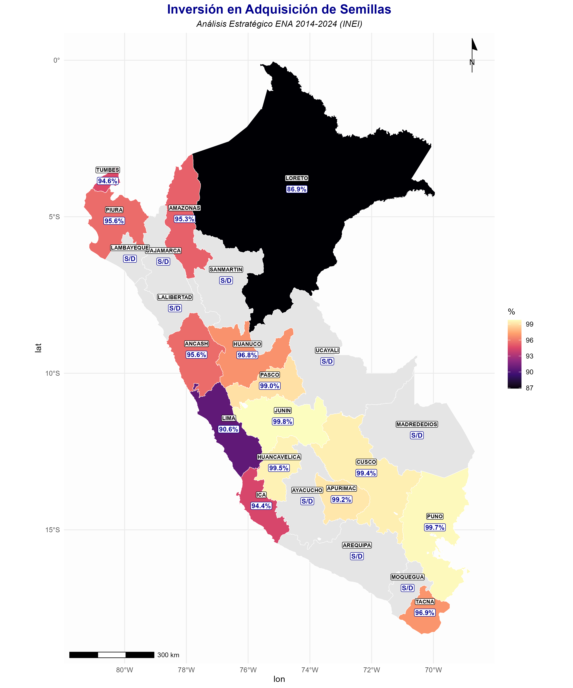

# Informe de Insights Agropecuarios: ENA 2014-2024
## Análisis Estratégico y Comparativo Departamental

Este informe detalla las discrepancias regionales en el sector agropecuario peruano, identificando oportunidades comerciales específicas basadas en datos reales.

---

### 1. Fragmentación Crítica en la Sierra Sur
**Variable:** `P14_TOTPARCELAS` (Promedio de parcelas)

*   **Hallazgo Específico:** Departamentos como **Huancavelica (4.94)** y **Puno (4.58)** presentan los niveles más altos de fragmentación. En contraste, la costa centro-norte como **Lima (1.44)** y **Lambayeque (1.64)** muestran unidades mucho más consolidadas.
*   **Insight:** La Sierra Sur requiere soluciones de mecanización a pequeña escala (motocultores) y programas de asociatividad para superar la ineficiencia de operar en 5 parcelas distintas por productor.
*   **Oportunidad:** Venta de herramientas de precisión y tecnología de riego para micro-parcelas.

---

### 2. Mercados de Tierras: Dinamismo en Costa y Selva Central
**Variable:** `P110_3` (% de Productores Arrendatarios)

*   **Hallazgo Específico:** **Lima (18.3%)** y **Junín (17.3%)** lideran el mercado de arrendamiento, seguidos por **Arequipa (15.1%)**. En el extremo opuesto, **Loreto (0.5%)** y **Ucayali (2.7%)** tienen un mercado de tierras prácticamente inexistente.
*   **Insight:** El arrendamiento en Lima y Junín indica una agricultura comercial de alta rotación. Los productores no poseen la tierra, lo que aumenta la demanda de créditos de campaña ultra-rápidos y servicios de "pay-per-use".
*   **Oportunidad:** Fintechs agrarias y seguros de cosecha para arrendatarios.

---

### 3. La Brecha de Productividad: Fertilizantes vs. Subsistencia
**Variable:** `P236` (% Uso de Abono/Fertilizante)

*   **Hallazgo Específico:** Existe un abismo entre la Selva Baja (**Loreto 2.2%**, **Ucayali 4%**) y la Sierra Central/Sur (**Huancavelica 72.4%**, **Junín 62.5%**).
*   **Insight:** Los bajísimos niveles en la selva indican una agricultura de "roza y quema" o de bajiales con mínima inversión tecnológica. Huancavelica, a pesar de su fragmentación, tiene una cultura de fertilización muy arraigada (abonos orgánicos/químicos).
*   **Oportunidad:** Mercado masivo de entrada para biofertilizantes en la Selva y optimización de dosis en la Sierra.

---

### 4. Dependencia de Insumos Externos (Semillas)
**Variable:** `P235` (% Gasto en Semilla)

*   **Hallazgo Específico:** La dependencia es casi total en la Sierra (**Junín 99.8%**, **Apurímac 99.2%**), mientras que en la Selva como **Ucayali (61.8%)** aún existe un alto porcentaje que no invierte en la compra de semilla certificada.
*   **Insight:** En Junín y Apurímac se ha pasado el umbral de subsistencia semillera; el productor ya entiende que debe comprar semilla. El reto aquí es la calidad (certificada vs. "de bolsa"). En Ucayali, el reto es el acceso al mercado.
*   **Oportunidad:** Posicionamiento de semillas híbridas y certificadas en departamentos con alto gasto para mejorar el rendimiento por hectárea.

---

### Conclusión Estratégica
El cliente debe priorizar **Junín y Lima** para servicios financieros y tecnológicos de vanguardia. Para la **Sierra Sur (Puno/Huancavelica)**, el enfoque debe ser logística y herramientas para pequeña escala. La **Selva** representa un mercado de expansión a largo plazo que requiere educación básica en el uso de insumos.
